<!-- TYPEWRITER ANIMATED HEADER -->

  

 

<!-- BADGES / HIGHLIGHT STATUS & PORTFOLIO -->

  
  
  

 

---

## 👨‍💻 About Me

  Myself <b>J MUKESHWAR RAUDRA</b> (also known as <i>Professor</i>). I am an aspiring <b>Quantum Computing Engineer</b> with a strong passion for technology and innovation. Currently in my learning phase, I am focused on exploring the world of <b>Artificial Intelligence</b>, <b>Web Development</b>, and <b>Quantum Computing</b>. I am a <b>Sophomore @ SRM IST</b>.

  🌐 <b>Portfolio &amp; Personal Website</b>: <a href="https://mukeshwar-raudra.vercel.app/" target="_blank"><b>https://mukeshwar-raudra.vercel.app/</b></a>

  <i>"I strongly believe that true growth comes from building, experimenting, and constantly learning. My goal is to transform my ideas into impactful tech solutions while continuing to evolve as a developer and AI model builder."</i>

  🚀 I am driven by the vision to make a mark in the tech world and be recognized for my work. I welcome opportunities to connect with People!

 

<!-- GIF 1: AFTER ABOUT ME -->

  
   
  <a href="https://giphy.com/gifs/coding-programming-ninjas-CcwLAV11cALh3OuEJ5" target="_blank">via GIPHY</a>

 

---

## 🏆 Roles & Credentials

<!-- GIF 2: LEFT SIDE OF ROLES & CREDENTIALS -->
<table border="0" width="100%">
  <tr>
    <td width="45%" align="center" valign="middle">
      
       
      <a href="https://giphy.com/gifs/pudgypenguins-data-code-coding-2IudUHdI075HL02Pkk" target="_blank">via GIPHY</a>
    </td>
    <td width="55%" valign="middle">
      <ul>
        <li>🎓 <b>Freshman @ SRM IST</b></li>
        <li>🌟 <b>Ex - Google Mentor</b></li>
        <li>🚀 <b>Codesapiens Community Lead</b></li>
        <li>💡 <b>Founder @ Nexora</b></li>
        <li>⚛️ <b>IBM Qiskit Advocate</b></li>
      </ul>
    </td>
  </tr>
</table>

 

---

## 🛠️ My Tech Stack

### 💻 Core Programming Languages & Web Technologies

  

 

### 🧠 Quantum, AI & Data Science Tools

  
  
  
  
  

 

---

## 🐍 Contribution Snake Game

  <picture>
    <source media="(prefers-color-scheme: dark)" srcset="https://raw.githubusercontent.com/P-r-o-f-e-s-s-o-r/P-r-o-f-e-s-s-o-r/output/github-contribution-grid-snake-dark.svg">
    <source media="(prefers-color-scheme: light)" srcset="https://raw.githubusercontent.com/P-r-o-f-e-s-s-o-r/P-r-o-f-e-s-s-o-r/output/github-contribution-grid-snake.svg">
    
  </picture>

 

---

## 📊 GitHub Analytics

  
    
  
    
  

 

---

## 🌐 Connect With Me

  
  &nbsp;
  
  &nbsp;
  
  &nbsp;
  
  &nbsp;
  

 

---

  <i>“Learning never exhausts the mind.” – Leonardo da Vinci</i>

